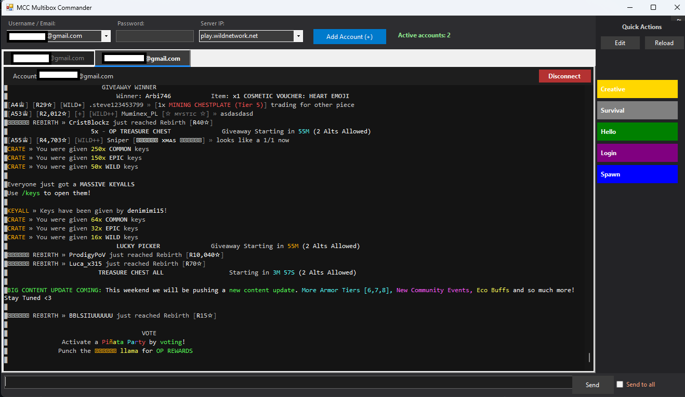

# MCC Multibox Commander (GUI Fork)

**A modern, dark-themed GUI for [Minecraft Console Client](https://github.com/MCCTeam/Minecraft-Console-Client) focused on multiboxing and macro management.**

[Features](#features) | [Installation](#installation) | [Usage](#usage) | [Building from Source](#building-from-source) | [Changelog](#changelog) | [License](#license)

---

## Screenshot



---

## About

This project is a modified fork of **Minecraft Console Client (MCC)**. The core logic relies on the robust MCCTeam implementation, while the GUI has been completely rewritten to support **managing multiple bots simultaneously** in a clean, modern dark interface.

---

## Features

### GUI Features (Added in this Fork)
- **Multiboxing** — run multiple Minecraft accounts in separate tabs within a single window
- **Dark Mode UI** — fully custom dark interface, no system white borders or artifacts
- **Custom Tab Bar** — tabs with close (✕) buttons, active tab highlighting, no TabControl flickering
- **Per-Tab Console** — each bot has its own output console with color-coded Minecraft chat
- **Log Filters** — filter console output by **All / Chat / System / Errors** per tab
- **Auto-save Logs** — each session is automatically saved to `logs/<nick>_<date>.txt`
- **Connection Timer** — displays uptime (HH:MM:SS) for each connected account
- **Bot Status Indicator** — colored dot (gray / green / red) shows connection state per tab
- **Auto-scroll Toggle** — checkbox to pause auto-scrolling so you can read history
- **Macro System** — side panel with quick-action buttons loaded from `macros.txt`
- **Global Send** — send a message or command to all connected bots simultaneously
- **Session History** — remembers last used usernames, IPs, and password (stored in `settings_v3.txt`)
- **Bilingual Support** — switch between English and Polish instantly

### Core MCC Features (Inherited)
- Connect to any Minecraft Java server (offline/online mode)
- Lightweight and fast
- Full chat and command support with Minecraft color code parsing
- Inventory handling, auto-response, and other core MCC features run in the background

---

## Installation

### Option 1: Installer (Recommended)
1. Download the latest **publish.zip** from the [Releases](../../releases) section
2. Extract the ZIP
3. Run **`setup.exe`**
4. Follow the installation prompts

### Option 2: Portable / Run from Folder
1. Download and extract **publish.zip** from [Releases](../../releases)
2. Run **`MinecraftClientGUI.exe`** directly — no installation needed

> On first launch, the app will automatically create `macros.txt` and `settings_v3.txt` in the same folder.

---

## Usage

### Connecting
1. Enter your **Username / Email**
2. Enter **Password** (leave blank for offline servers)
3. Enter **Server IP**
4. Click **+ Add Account**
5. A new tab opens and the bot connects automatically

> If you use an email address, only the part before `@` is shown as the tab title.

### Macros
1. Click **Edit** in the Quick Actions panel
2. Add lines in the format: `Label|/command|Color`
   - Example: `Spawn|/spawn|Blue`
3. Save the file and click **Reload**
4. Click any macro button to send the command to the active tab (or all tabs if "Send to all" is checked)

### Log Filters
Each tab has a filter bar with four buttons:
- **All** — show everything
- **Chat** — show only in-game chat messages
- **System** — show only `[SYS]` events (connect, disconnect, sent commands)
- **Errors** — show only `[ERR]` events

### Session Logs
Logs are saved automatically to the `logs/` folder next to the executable.  
File format: `logs/<nick>_<yyyy-MM-dd_HH-mm>.txt`

---

## Building from Source

### Requirements
- Visual Studio 2019 or newer
- .NET Framework 4.x

### Steps
1. Clone this repository:
   ```
   git clone https://github.com/AnonBOTpl/Minecraft-Console-Client-GUI
   ```
2. Open **`MinecraftClientGUI.sln`** in Visual Studio
3. Set configuration to **Release** (not Debug) in the toolbar dropdown
4. Build the solution: **Build → Build Solution** (`Ctrl+Shift+B`)
5. The output will be in `MinecraftClientGUI\bin\Release\`
6. Copy `MinecraftClient.exe` (built separately from the `MinecraftClient` project) to the same folder

### Creating the Installer
1. Build in **Release** mode first (see above)
2. In Visual Studio: **Build → Publish MinecraftClientGUI**
3. The installer (`setup.exe` + `publish.zip`) will be generated in the `publish\` folder

---

## Updating MCC Core

This GUI ships with a specific version of `MinecraftClient.exe` (MCC build 285, for Minecraft 1.20.4).

If you want to use a newer version of Minecraft, you can update the core manually:

1. Download the latest `MinecraftClient.exe` from the [official MCC releases](https://github.com/MCCTeam/Minecraft-Console-Client/releases/latest)
2. Replace `MinecraftClient.exe` in the folder where `MinecraftClientGUI.exe` is located
3. The GUI itself does not need to be rebuilt — it will automatically use the new core

> **Note:** Newer versions of MCC may change their output format or arguments, which could cause display issues in the GUI. If something breaks after updating, check the [MCC changelog](https://github.com/MCCTeam/Minecraft-Console-Client/releases) for breaking changes.

---

## Changelog

### v2.0.0 — 2026-02-21
**Major UI overhaul — complete rewrite of the graphical interface**

#### New Features
- Replaced `TabControl` with a fully custom tab bar — eliminates all white system borders
- Active tab now visually elevated with a blue accent underline
- Each tab has a **✕ close button**
- **Log filter bar** per tab: All / Chat / System / Errors
- **Auto-save session logs** — saved automatically to `logs/` folder on connect
- **Connection uptime timer** (HH:MM:SS) displayed in each tab's header bar
- **Bot status dot** — gray (connecting), green (connected), red (disconnected)
- **Auto-scroll toggle checkbox** per tab
- Email addresses are now trimmed — only the username part (before `@`) shown as tab title
- Language switch button is now a large, clearly visible button at the top of the sidebar

#### Improvements
- Dark ComboBox with custom draw — no more white dropdown backgrounds
- Macro buttons redesigned — colored left-side accent bar instead of full background color
- Bottom chat bar padding fixed — no more phantom border below input field
- Spacing between Disconnect and Auto-scroll buttons fixed

---

### v1.0.0 — 2026-02-13
**Initial release**

- Dark-themed GUI for MCC
- Multiboxing support with tabbed interface
- Macro system (`macros.txt`)
- EN/PL language support
- Session history for logins and IPs (`settings_v3.txt`)
- Minecraft chat color code parsing (`§` codes)
- Global send (send to all connected bots)
- Active account counter

---

## Credits & License

**This project is a fork of [Minecraft Console Client](https://github.com/MCCTeam/Minecraft-Console-Client).**

- **GUI & Multibox modifications:** [AnonBOTpl](https://github.com/AnonBOTpl)
- **Core Logic & Original Project:** Copyright © 2012–2024 MCC Team & Contributors

Licensed under **CDDL-1.0**.  
Full license: http://opensource.org/licenses/CDDL-1.0
